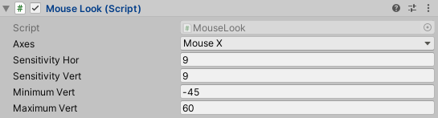
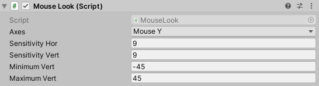

\*\*\* ПЕРЕКЛЮЧЕНИЕ СЛАЙДА 1 -\> 2

ПОДГОТОВКА К ПРОГРАММИРОВАНИЮ В UNITY
=====================================

Для начала, посмотрим, как в Unity выглядит процесс программирования. Компоновка
игровых ресурсов происходит в визуальном редакторе, но для обеспечения
интерактивности игры требуется управляющий ресурсами код. В приложении Unity
поддерживается ряд языков программирования, в частности JavaScript и C\#. Каждый
вариант имеет свои достоинства и недостатки, но я выбрал C\#. Причиной выбора
стало отсутствие в JS статической типизации и отсутствие поддержки в Unity
JS-фреймворков, привносящих статическую типизацию. Например, отсутствует
поддержка TypeScript, разработанного Microsoft. В Unity добавлена директива
\#pragma, принудительно обеспечивающая статическую проверку типов в JavaScript.
Технически такое вполне допустимо, но при этом нарушается один из основных
принципов функционирования JavaScript. Поэтому лучше изначально было лучше
выбрать язык со строгой типизацией.

Попробуем написать и запустить код.

\*\*\* ПЕРЕКЛЮЧЕНИЕ СЛАЙДА 2 -\> 3

Для этого нужно открыть Unity на ссылке New в окне. Откроется окно New Project,
предназначенное для создания нового проекта. Далее нажать Create.

После некоторых приготовлений, Unity создал новый проект.

\*\*\* ПЕРЕКЛЮЧЕНИЕ СЛАЙДА 3-\> 4

Создалась пустая сцена будущей игры.

\*\*\* ПЕРЕКЛЮЧЕНИЕ СЛАЙДА 4-\> 5

ЗАПУСК КОДА
===========

Для запуска игры в Unity сначала нужно связать файлы с каким-нибудь объектом
сцены.

\*\*\* ПЕРЕКЛЮЧЕНИЕ СЛАЙДА 5 -\> 6

Игровые компоненты создаются как наборы компонентов, и в каждый такой набор
может входить исполняемый сценарий.

\*\*\* ПЕРЕКЛЮЧЕНИЕ СЛАЙДА 6 -\> 7

В Unity сценарии представляют собой компоненты, но не все сценарии, а только те,
которые наследуются от класса monobehaviour, базового класса
компонентов-сценариев.

Наследование этого класса даёт сразу пару автоматически запускаемых методов,
которые в последствие можно будет переопределить. Это метод Start(), вызываемый
при активации объекта, и вызываемый в каждом кадре метод Update().

Чтобы создать сценарий, нужно открыть меню Assets, навестись на Create и в
открывшемся меню выбрать C\# script.

\*\*\* ПЕРЕКЛЮЧЕНИЕ СЛАЙДА 7 -\> 8

Либо, можно внизу в меню Project нажать правой кнопкой в поле Assets, навестись
на Create и выбрать C\# script. Затем можно изменить название сценария.

\*\*\* ПЕРЕКЛЮЧЕНИЕ СЛАЙДА 8 -\> 9

В результате сгенерируется следующий код сценария код сценария.

\*\*\* ПЕРЕКЛЮЧЕНИЕ СЛАЙДА 9 -\> 10

Сгенерировался новый класс HelloWorld, который наследуется от MonoBehaviour и
реализующий методы Start и Update.

В итоге мы получили ни к чему не привязанный код сценария. Добавим на сцену
новый объект.

Для этого выберем в меню GameObject пункт Create Empty и на вкладка hierarchy
появится пустой объект GameObject.

\*\*\* ПЕРЕКЛЮЧЕНИЕ СЛАЙДА 10 -\> 11

На панели Inspector добавим сценарий HelloWorld к полученному объекту.

Нажмём на AddComponent и выберем ранее созданный сценарий.

\*\*\* ПЕРЕКЛЮЧЕНИЕ СЛАЙДА 11 -\> 12

Изменим файл сценария так, чтобы при запуске проекта выводилось сообщение в
консоль.

\*\*\* ПЕРЕКЛЮЧЕНИЕ СЛАЙДА 12 -\> 13

И запустим проект

\*\*\* ПЕРЕКЛЮЧЕНИЕ СЛАЙДА 13 -\> 14

В консоль вывелось сообщение.

Попробуем создать более сложный проект.

\*\*\* ПЕРЕКЛЮЧЕНИЕ СЛАЙДА 14 -\> 15

\*\*\*\* НАЧИНАЕТСЯ ДЕМОНСТРАЦИЯ РАЗРАБОТКИ

На панели Inspector мы видим, что этому объекту назначен капсульный коллайдер.
Это очевидный вариант для объекта Capsule, точно так же, как объект Cube по
умолчанию обладает коллайдером Box. Но так как наша капсула будет представлять
игрока, ее компоненты должны слегка отличаться от компонентов большинства
объектов. Капсульный коллайдер мы удалим. Для этого нужно щелкнуть на значке с
изображением шестерни справа от имени компонента. Откроется меню, в котором в
числе прочих вы найдете и команду Remove Component. Коллайдер выглядит как
окружающая объект зеленая сетка, поэтому после удаления компонента вы
обнаружите, что она исчезла.

Вместо капсульного коллайдера мы назначим объекту контроллер персонажа. В нижней
части панели Inspector вы найдете кнопку Add Component. Щелчок на ней открывает
меню с перечнем типов доступных компонентов. В разделе Physics и находится
нужная нам строка Character Controller. Как несложно догадаться, именно этот
компонент позволит объекту вести себя как персонаж.

Для завершения настройки игрока осталось сделать всего один шаг — присоединить к
нему камеру. Расположу ее таким образом, чтобы она соответствовала глазам
игрока. Я укажу координаты 0, 1.5, 0

Итак, в сцене присутствуют все необходимые объекты. Осталось написать код
перемещения игрока.

Для того, чтобы заставить игрока перемещаться по сцене, нам понадобятся сценарии
движения, которые будут присоединены к игроку.

Анимация объекта сводится к его смещению в каждом кадре на небольшое расстояние
и последующему многократному воспроизведению всех кадров. Само по себе
преобразование происходит мгновенно, в отличие от движения, растянутого во
времени. Но последовательное применение набора преобразований вызывает
визуальное перемещение объекта.

Добавим вращение персонажа. В методе Update добавим следующий код:

using System.Collections;

using System.Collections.Generic;

using UnityEngine;

public class Spin : MonoBehaviour

{

    public float speed = 3.0f;

    *// Update is called once per frame*

    void Update()

    {

        transform.Rotate(0, speed, 0, Space.Self); - Self – вокруг локальных

World – вокруг глобальных

    }

}

Вместо просто вращения вокруг себя добавим слежение за мышью

Добавим следующий код

using System.Collections;

using System.Collections.Generic;

using UnityEngine;

public class MouseLook : MonoBehaviour

{

  public enum RotationAxes

  {

    MouseXAndY = 0, MouseX = 1, MouseY = 2 // порядок следования в редакторе

  }

  public RotationAxes axes = RotationAxes.MouseXAndY;

  void Update()

  {

// какая настройка выбрана в редакторе

    if (axes == RotationAxes.MouseX)

    {

*// это поворот в горизонтальной плоскости *    

}

    else if (axes == RotationAxes.MouseY)

    { *// это поворот в вертикальной плоскости *

    }

    else

    {

      *// это комбинированный поворот *

    }

  }

}

Добавлю скорость поворота камеры по горизонтали (перед Update, но после
RotationAxes)

public float sensitivityHor = 9.0f;

И само вращение камеры

transform.Rotate(0, sensitivityHor, 0);

Попробуем запустить. Опять вращается сама камера. Попробуем это исправить.

Добавим Метод Input.GetAxis(“Mouse X”) – который будет возвращать значение
положения курсора по X.

Совместим

transform.Rotate(0, Input.GetAxis("Mouse X") \* sensitivityHor, 0);

Теперь камера реагирует на движение мыши.

Добавим поворот по вертикали.

Для этого нужно скорость поворота камеры по вертикали и граничные углы поворота
камеры.

public float sensitivityVert = 9.0f;

public float minimumVert = -45.0f;

public float maximumVert = 45.0f;

private float _rotationX = 0;

Так же нужно определить, на какое значение изменилось положение курсора мыши по
вертикали. Для этого используем функцию Input.GetAxis("Mouse Y"). Если курсор
сместился вверх, то значение будет отрицательным, если вниз – положительным.
Полученное значение умножаем на скорость поворота и вычитаем из переменной угла
поворота. Затем устанавливаем полученное значение в рамки минимального и
максимального значения по горизонтали. И в конечном итоге устанавливаем угол
поворота компонента равным вектору из полученного угла поворота по вертикали,
текущего угла поворота по вертикали и 0 по оси z.

else if (axes == RotationAxes.MouseY)

{

      _rotationX -= Input.GetAxis("Mouse Y") \* sensitivityVert;

      _rotationX = Mathf.Clamp(_rotationX, minimumVert, maximumVert);

      transform.localEulerAngles = new Vector3(_rotationX, transform.localEulerAngles.y, 0);

}

Попробуем вращать объект сразу по всем осям.

Для этого совместим блоки поворота по горизонтали и вертикали. Получим:

else

{

      _rotationX -= Input.GetAxis("Mouse Y") \* sensitivityVert;

      _rotationX = Mathf.Clamp(_rotationX, minimumVert, maximumVert);

      float delta = Input.GetAxis("Mouse X") \* sensitivityHor;

      float rotationY = transform.localEulerAngles.y + delta;

      transform.localEulerAngles = new Vector3(_rotationX, rotationY, 0);

}

Rigidbody — это дополнительный компонент, которым может обладать объект.
Моделируе­мая физическая среда влияет на этот компонент и управляет объектами, к
которым он присо­единен.

В случаях, когда поворот персонажа осуществляется только мышью, к компоненту
RigidBoby игрока добавляют свойство freezeRotation, благодаря которому на
вращение игрока не влияет смоделированная физическая среда.

В итоге имеем следующий код:

using System.Collections;

using System.Collections.Generic;

using UnityEngine;

public class MouseLook : MonoBehaviour

{

  public enum RotationAxes

  {

    MouseXAndY = 0,

    MouseX = 1,

    MouseY = 2

  }

  public RotationAxes axes = RotationAxes.MouseXAndY;

  public float sensitivityHor = 9.0f;

  public float sensitivityVert = 9.0f;

  public float minimumVert = -45.0f;

  public float maximumVert = 45.0f;

  private float _rotationX = 0;

  void Start()

  {

    Rigidbody body = GetComponent\<Rigidbody\>();

    if (body != null)

      body.freezeRotation = true;

  }

  void Update()

  {

    if (axes == RotationAxes.MouseX)

    {

      transform.Rotate(0, Input.GetAxis("Mouse X") \* sensitivityHor, 0);

    }

    else if (axes == RotationAxes.MouseY)

    {

      _rotationX -= Input.GetAxis("Mouse Y") \* sensitivityVert;

      _rotationX = Mathf.Clamp(_rotationX, minimumVert, maximumVert);

      float rotationY = transform.localEulerAngles.y;

      transform.localEulerAngles = new Vector3(_rotationX, rotationY, 0);

    }

    else

    {

      _rotationX -= Input.GetAxis("Mouse Y") \* sensitivityVert;

      _rotationX = Mathf.Clamp(_rotationX, minimumVert, maximumVert);

      float delta = Input.GetAxis("Mouse X") \* sensitivityHor;

      float rotationY = transform.localEulerAngles.y + delta;

      transform.localEulerAngles = new Vector3(_rotationX, rotationY, 0);

    }

  }

}

Теперь добавим возможность перемещаться по карте. Для этого создадим новый
сценарий перемещения. В него добавим скорость перемещения speed = 2.0f и функцию
Update.

public float speed = 2.0f;

В ней будем выполнять функции Input.GetAxis("Horizontal") и
Input.GetAxis("Vertical"), которые будут получать смещение по клавишам A/D и W/S
соответственно. Умножать полученные значения на скорость передвижения и на
одинаковые для всех компьютеров значение времени нажатия клавиши, равное 1/30, и
перемещать игрока на полученные координаты.

float deltaX = Input.GetAxis("Horizontal") \* speed;

float deltaZ = Input.GetAxis("Vertical") \* speed;

transform.Translate(deltaX \* Time.deltaTime, 0, deltaZ \* Time.deltaTime);

\*\* игрок может перемещаться сквозь стены

Как мы видим, персонаж может свободно передвигаться сквозь стены. Это
происходит, так как преобразования не затрагивают такой аспект, как
распознавание столкновений. Поэтому мы в начале применили к персонажу компонент
CharacterController. Именно он сейчас нам обеспечит естественность движений.

Сначала мы получаем компонент CharacterController игрока. Затем мы ограничиваем
передвижение игрока по диагонали такой же скоростью, что и передвижение
параллельно осям. Преобразуем вектор движения от локальных к глобальным
координатам и перемещаем CharacterController полученным вектором.

private CharacterController _charController;

void Start()

{

    _charController = GetComponent\<CharacterController\>();

}

void Update()

{

    float deltaX = Input.GetAxis("Horizontal") \* speed;

    float deltaZ = Input.GetAxis("Vertical") \* speed;

    Vector3 movement = new Vector3(deltaX, 0, deltaZ);

    movement = Vector3.ClampMagnitude(movement, speed);

    movement \*= Time.deltaTime;

movement = transform.TransformDirection(movement);

    _charController.Move(movement);

}

Теперь сделаем так, чтобы наш персонаж ходил, а не летал. Для этого добавим силу
тяжести.

movement.y = gravity;

И добавим постоянное передвижение вниз с полученной скоростью.

\*\* при вертикальном перемещении курсора происходит перемещение персонажа.

Это объясняется тем, что у нас персонаж постоянно наклоняется и у него сдвинут
центр тяжести. Исправить это можно ограничив персонажа только горизонтальными
поворотами и добавив камере вертикальные повороты.

\*\* Персонаж:

\*\* Камера:

И для проверки, что к персонажу подсоединены все необходимые компоненты
воспользуемся методом RequireComponent()

[RequireComponent(typeof(CharacterController))]

В итоге имеем следующий код:

using System.Collections;

using System.Collections.Generic;

using UnityEngine;

[RequireComponent(typeof(CharacterController))]

public class CharacterControll : MonoBehaviour

{

  public float speed = 2.0f;

  public float gravity = -9.8f;

  private CharacterController _charController;

  void Start()

  {

    _charController = GetComponent\<CharacterController\>();

  }

  *// Update is called once per frame*

  void Update()

  {

    float deltaX = Input.GetAxis("Horizontal") \* speed;

    float deltaZ = Input.GetAxis("Vertical") \* speed;

    Vector3 movement = new Vector3(deltaX, 0, deltaZ);

    movement.y = gravity;

    movement = Vector3.ClampMagnitude(movement, speed);

    movement \*= Time.deltaTime; movement = transform.TransformDirection(movement);

    _charController.Move(movement);

  }

}

Персонаж умеет поворачивать смотреть по сторонам и перемещаться.
